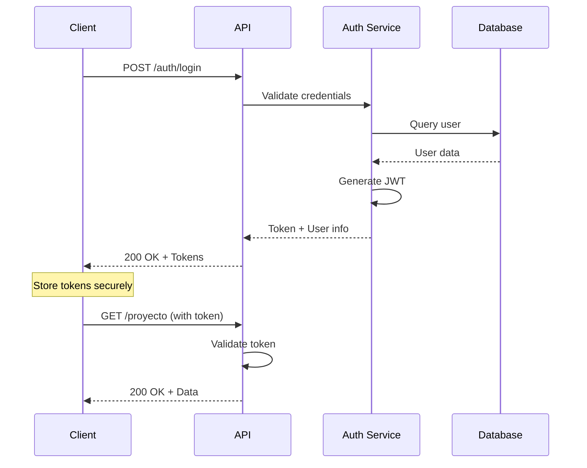

# Authentication API

Endpoints for user authentication and session management.

## Login

<api method="POST" url="/api/v1/auth/login" description="Authenticate user and obtain JWT tokens">

### Request Body

```json
{
  "username": "string",
  "password": "string"
}
```

### Request Example

```bash
curl -X POST http://localhost:8080/api/v1/auth/login \
  -H "Content-Type: application/json" \
  -d '{
    "username": "admin",
    "password": "admin123"
  }'
```

### Response (200 OK)

```json
{
  "token": "eyJhbGciOiJIUzI1NiIsInR5cCI6IkpXVCJ9.eyJzdWIiOiJhZG1pbiIsInJvbGVzIjpbIlJPTEVfQURNSU4iXSwiaWF0IjoxNzA2OTcxMjM0LCJleHAiOjE3MDcwNTc2MzR9.signature",
  "refreshToken": "eyJhbGciOiJIUzI1NiIsInR5cCI6IkpXVCJ9.eyJzdWIiOiJhZG1pbiIsInR5cGUiOiJyZWZyZXNoIiwiaWF0IjoxNzA2OTcxMjM0LCJleHAiOjE3MDc1NzYwMzR9.signature",
  "expiresIn": 86400,
  "user": {
    "id": 1,
    "username": "admin",
    "email": "admin@vortexbird.com",
    "nombre": "Administrator",
    "roles": ["ROLE_ADMIN"]
  }
}
```

### Response Fields

| Field | Type | Description |
|-------|------|-------------|
| `token` | string | JWT access token (24h expiration) |
| `refreshToken` | string | JWT refresh token (7d expiration) |
| `expiresIn` | number | Token expiration in seconds |
| `user` | object | User information |
| `user.id` | number | User ID |
| `user.username` | string | Username |
| `user.email` | string | Email address |
| `user.nombre` | string | Full name |
| `user.roles` | string[] | Assigned roles |

### Error Responses

#### 401 Unauthorized - Invalid Credentials

```json
{
  "timestamp": "2024-02-03T20:30:45.123Z",
  "status": 401,
  "error": "Unauthorized",
  "message": "Invalid username or password",
  "path": "/api/v1/auth/login"
}
```

#### 400 Bad Request - Validation Error

```json
{
  "timestamp": "2024-02-03T20:30:45.123Z",
  "status": 400,
  "error": "Bad Request",
  "message": "Validation failed",
  "errors": [
    {
      "field": "username",
      "message": "Username is required"
    }
  ],
  "path": "/api/v1/auth/login"
}
```

</api>

## SSO Login

<api method="POST" url="/api/v1/ssoLogin/validateTokenAndOptions" description="Validate SSO token and retrieve user options">

### Headers

```
Authorization: Bearer <sso_token>
```

### Request Example

```bash
curl -X POST http://localhost:8080/api/v1/ssoLogin/validateTokenAndOptions \
  -H "Authorization: Bearer <sso_token>"
```

### Response (200 OK)

```json
{
  "tokenValid": true,
  "user": {
    "username": "user@vortexbird.com",
    "email": "user@vortexbird.com",
    "nombre": "John Doe"
  },
  "options": [
    {
      "id": 1,
      "name": "Dashboard",
      "url": "/dashboard",
      "icon": "dashboard"
    },
    {
      "id": 2,
      "name": "Projects",
      "url": "/projects",
      "icon": "folder"
    }
  ],
  "roles": ["ROLE_USER"]
}
```

</api>

## Using Authentication Tokens

### Include Token in Requests

All protected endpoints require the JWT token in the Authorization header:

```bash
curl -X GET http://localhost:8080/api/v1/proyecto/encontrarTodosProyectos \
  -H "Authorization: Bearer YOUR_TOKEN_HERE"
```

### Token Refresh

When the access token expires (after 24 hours), use the refresh token to obtain a new access token:

```bash
curl -X POST http://localhost:8080/api/v1/auth/refresh \
  -H "Content-Type: application/json" \
  -d '{
    "refreshToken": "YOUR_REFRESH_TOKEN_HERE"
  }'
```

<Note>
The refresh token is valid for 7 days. After it expires, users must log in again.
</Note>

## Authentication Flow



## Security Considerations

<Warning>
Never commit tokens or credentials to version control. Use environment variables for sensitive configuration.
</Warning>

**Best Practices**:
- Store tokens securely (httpOnly cookies recommended)
- Implement automatic token refresh before expiration
- Clear tokens on logout
- Use HTTPS in production
- Implement request rate limiting
- Monitor failed login attempts
