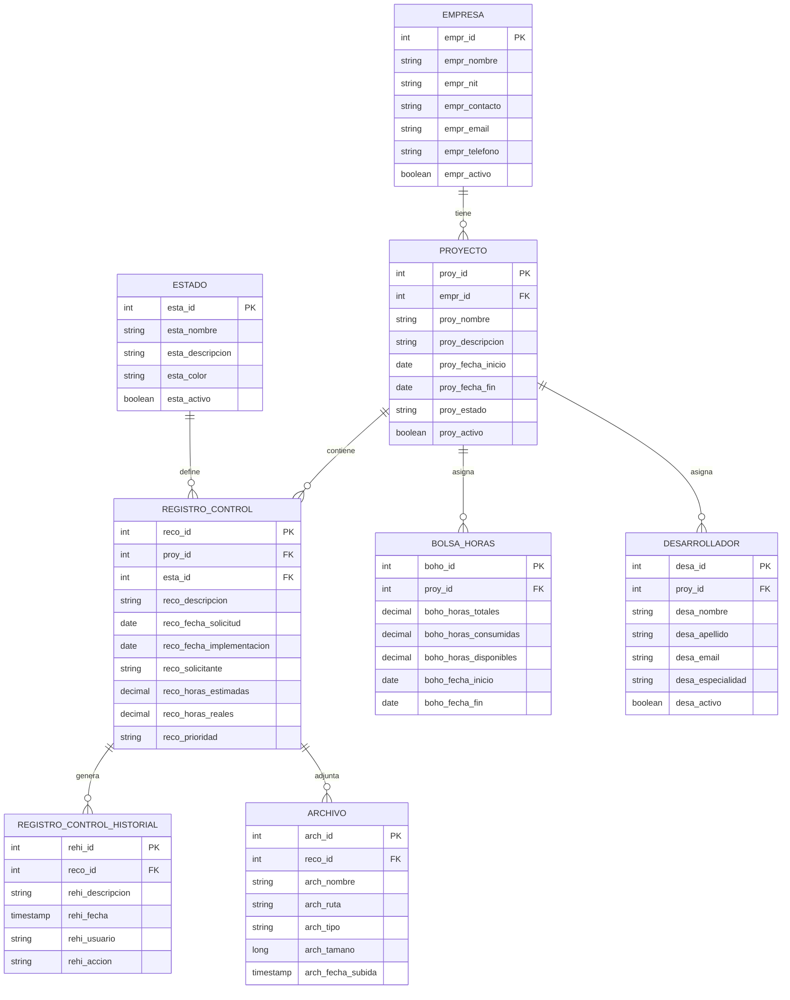

# Database Schema

Control de Cambios uses PostgreSQL as its primary database with JPA/Hibernate for ORM.

## Entity Relationship Diagram



## Core Entities

### Empresa (Company)

Represents companies that own projects.

**Table**: `cc_empresa`

| Field | Type | Description |
|-------|------|-------------|
| `empr_id` | INT | Primary key |
| `empr_nombre` | VARCHAR(100) | Company name |
| `empr_nit` | VARCHAR(20) | Tax ID number |
| `empr_contacto` | VARCHAR(100) | Contact person |
| `empr_email` | VARCHAR(100) | Contact email |
| `empr_telefono` | VARCHAR(20) | Contact phone |
| `empr_activo` | BOOLEAN | Active status |

### Proyecto (Project)

Represents software projects managed by the system.

**Table**: `cc_proyecto`

| Field | Type | Description |
|-------|------|-------------|
| `proy_id` | INT | Primary key |
| `empr_id` | INT | Foreign key to Empresa |
| `proy_nombre` | VARCHAR(200) | Project name |
| `proy_descripcion` | TEXT | Project description |
| `proy_fecha_inicio` | DATE | Start date |
| `proy_fecha_fin` | DATE | End date |
| `proy_estado` | VARCHAR(50) | Project status |
| `proy_activo` | BOOLEAN | Active status |

### RegistroControl (Change Control Record)

Main entity representing a change request or control record.

**Table**: `cc_registro_control`

| Field | Type | Description |
|-------|------|-------------|
| `reco_id` | INT | Primary key |
| `proy_id` | INT | Foreign key to Proyecto |
| `esta_id` | INT | Foreign key to Estado |
| `reco_descripcion` | TEXT | Change description |
| `reco_fecha_solicitud` | DATE | Request date |
| `reco_fecha_implementacion` | DATE | Implementation date |
| `reco_solicitante` | VARCHAR(100) | Requester name |
| `reco_horas_estimadas` | DECIMAL(10,2) | Estimated hours |
| `reco_horas_reales` | DECIMAL(10,2) | Actual hours |
| `reco_prioridad` | VARCHAR(20) | Priority level |
| `reco_observaciones` | TEXT | Observations |
| `reco_usuario_creacion` | VARCHAR(50) | Created by |
| `reco_fecha_creacion` | TIMESTAMP | Created at |
| `reco_usuario_modificacion` | VARCHAR(50) | Modified by |
| `reco_fecha_modificacion` | TIMESTAMP | Modified at |

### RegistroControlHistorial (Change History)

Tracks all changes made to a RegistroControl.

**Table**: `cc_registro_control_historial`

| Field | Type | Description |
|-------|------|-------------|
| `rehi_id` | INT | Primary key |
| `reco_id` | INT | Foreign key to RegistroControl |
| `rehi_descripcion` | TEXT | Change description |
| `rehi_fecha` | TIMESTAMP | Change timestamp |
| `rehi_usuario` | VARCHAR(50) | User who made change |
| `rehi_accion` | VARCHAR(50) | Action performed |

### BolsaHoras (Hour Pool)

Manages allocated hours for projects.

**Table**: `cc_bolsa_horas`

| Field | Type | Description |
|-------|------|-------------|
| `boho_id` | INT | Primary key |
| `proy_id` | INT | Foreign key to Proyecto |
| `boho_horas_totales` | DECIMAL(10,2) | Total allocated hours |
| `boho_horas_consumidas` | DECIMAL(10,2) | Consumed hours |
| `boho_horas_disponibles` | DECIMAL(10,2) | Available hours |
| `boho_fecha_inicio` | DATE | Start date |
| `boho_fecha_fin` | DATE | End date |
| `boho_observaciones` | TEXT | Observations |

### Desarrollador (Developer)

Represents developers assigned to projects.

**Table**: `cc_desarrollador`

| Field | Type | Description |
|-------|------|-------------|
| `desa_id` | INT | Primary key |
| `proy_id` | INT | Foreign key to Proyecto |
| `desa_nombre` | VARCHAR(50) | First name |
| `desa_apellido` | VARCHAR(50) | Last name |
| `desa_email` | VARCHAR(100) | Email address |
| `desa_especialidad` | VARCHAR(100) | Specialization |
| `desa_activo` | BOOLEAN | Active status |

### Archivo (File)

Stores file attachments for change control records.

**Table**: `cc_archivo`

| Field | Type | Description |
|-------|------|-------------|
| `arch_id` | INT | Primary key |
| `reco_id` | INT | Foreign key to RegistroControl |
| `arch_nombre` | VARCHAR(200) | File name |
| `arch_ruta` | VARCHAR(500) | File path |
| `arch_tipo` | VARCHAR(50) | File MIME type |
| `arch_tamano` | BIGINT | File size in bytes |
| `arch_fecha_subida` | TIMESTAMP | Upload timestamp |

### Estado (Status)

Defines possible statuses for change control records.

**Table**: `cc_estado`

| Field | Type | Description |
|-------|------|-------------|
| `esta_id` | INT | Primary key |
| `esta_nombre` | VARCHAR(50) | Status name |
| `esta_descripcion` | VARCHAR(200) | Status description |
| `esta_color` | VARCHAR(7) | Color code (hex) |
| `esta_activo` | BOOLEAN | Active status |

**Common Status Values**:
- PENDIENTE (Pending)
- EN_PROGRESO (In Progress)
- COMPLETADO (Completed)
- RECHAZADO (Rejected)
- CANCELADO (Cancelled)

### UserApplication (User)

Application users with authentication.

**Table**: `cc_user_application`

| Field | Type | Description |
|-------|------|-------------|
| `usap_id` | INT | Primary key |
| `usap_username` | VARCHAR(50) | Username (unique) |
| `usap_password` | VARCHAR(255) | Encrypted password |
| `usap_email` | VARCHAR(100) | Email address |
| `usap_nombre` | VARCHAR(100) | Full name |
| `usap_activo` | BOOLEAN | Active status |
| `usap_roles` | VARCHAR(200) | User roles |

### Parametros (Parameters)

System configuration parameters.

**Table**: `cc_parametros`

| Field | Type | Description |
|-------|------|-------------|
| `para_id` | INT | Primary key |
| `para_codigo` | VARCHAR(50) | Parameter code |
| `para_nombre` | VARCHAR(100) | Parameter name |
| `para_valor` | TEXT | Parameter value |
| `para_descripcion` | TEXT | Description |
| `para_activo` | BOOLEAN | Active status |

## Relationships

### One-to-Many Relationships

- **Empresa → Proyecto**: One company has many projects
- **Proyecto → RegistroControl**: One project has many change records
- **Proyecto → BolsaHoras**: One project has many hour pools
- **Proyecto → Desarrollador**: One project has many developers
- **RegistroControl → RegistroControlHistorial**: One record has many history entries
- **RegistroControl → Archivo**: One record has many file attachments
- **Estado → RegistroControl**: One status applies to many records

## Indexes

For optimal query performance, ensure the following indexes exist:

```sql
-- Foreign key indexes
CREATE INDEX idx_proyecto_empr_id ON cc_proyecto(empr_id);
CREATE INDEX idx_registro_control_proy_id ON cc_registro_control(proy_id);
CREATE INDEX idx_registro_control_esta_id ON cc_registro_control(esta_id);
CREATE INDEX idx_historial_reco_id ON cc_registro_control_historial(reco_id);
CREATE INDEX idx_archivo_reco_id ON cc_archivo(reco_id);
CREATE INDEX idx_bolsa_horas_proy_id ON cc_bolsa_horas(proy_id);
CREATE INDEX idx_desarrollador_proy_id ON cc_desarrollador(proy_id);

-- Query optimization indexes
CREATE INDEX idx_registro_control_fecha ON cc_registro_control(reco_fecha_solicitud);
CREATE INDEX idx_proyecto_estado ON cc_proyecto(proy_estado);
CREATE INDEX idx_user_username ON cc_user_application(usap_username);
```

## Audit Fields

Most entities include audit fields:

- `usuario_creacion` - User who created the record
- `fecha_creacion` - Timestamp of creation
- `usuario_modificacion` - User who last modified
- `fecha_modificacion` - Timestamp of last modification

These are automatically populated by JPA listeners.

## Naming Conventions

- **Tables**: Prefixed with `cc_` (Control de Cambios)
- **Columns**: Prefixed with entity abbreviation (e.g., `empr_`, `proy_`)
- **Primary Keys**: `<entity>_id`
- **Foreign Keys**: Reference the primary key name
- **Boolean fields**: Suffixed with descriptive terms (e.g., `_activo`)
