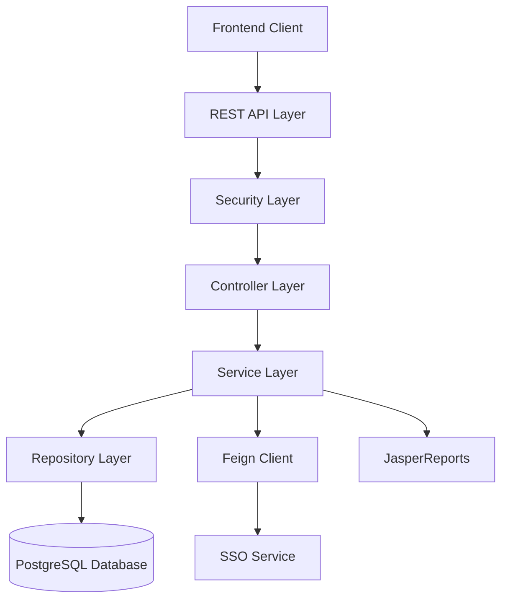
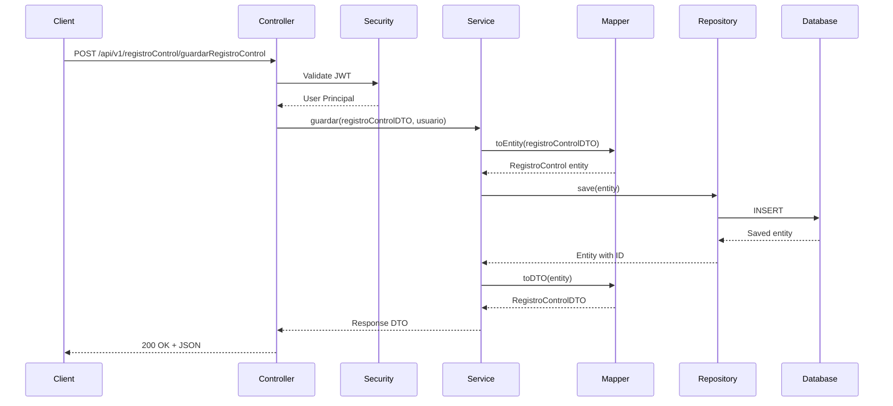

# Architecture Overview

Control de Cambios follows a layered architecture pattern based on Spring Boot best practices.

## System Architecture

## Architectural Layers

### 1. Controller Layer

**Location**: `com.vortexbird.control.cambio.controller`

- Handles HTTP requests and responses
- Validates input data
- Maps DTOs to domain models
- Returns appropriate HTTP status codes

**Key Controllers**:
- `AuthRestController` - Authentication
- `CcRegistroControlRestController` - Change control records
- `CcProyectoRestContoller` - Project management
- `CcDesarrolladorRestController` - Developer management
- `CcBolsaHorasRestController` - Hour pool management
- `CcEmpresaRestController` - Company management
- `CcArchivoRestController` - File management
- `CcEstadoRestController` - Status management

### 2. Service Layer

**Location**: `com.vortexbird.control.cambio.service`

- Contains business logic
- Coordinates between repositories
- Handles transactions
- Performs validations

**Design Pattern**: Service Interface + Implementation

### 3. Repository Layer

**Location**: `com.vortexbird.control.cambio.repository`

- Data access layer using Spring Data JPA
- Extends `JpaRepository` for CRUD operations
- Custom query methods
- Database transaction management

### 4. Domain Layer

**Location**: `com.vortexbird.control.cambio.domain`

- JPA entities
- Represents database tables
- Defines relationships between entities
- Uses Lombok for boilerplate reduction

### 5. DTO Layer

**Location**: `com.vortexbird.control.cambio.dto`

- Data Transfer Objects
- Decouples API from domain model
- Validation annotations
- API request/response models

### 6. Mapper Layer

**Location**: `com.vortexbird.control.cambio.mapper`

- Uses MapStruct for object mapping
- Converts between entities and DTOs
- Reduces boilerplate code
- Compile-time type safety

## Key Design Patterns

### Layered Architecture

Clear separation of concerns across layers:
- **Presentation** → Controllers
- **Business Logic** → Services
- **Data Access** → Repositories
- **Data Model** → Domain Entities

### Repository Pattern

- Abstracts data access logic
- Provides clean API for data operations
- Enables easy testing with mock repositories

### DTO Pattern

- Separates internal domain models from API contracts
- Provides versioning flexibility
- Reduces over-fetching of data

### Dependency Injection

- Uses Spring's IoC container
- `@Autowired` for automatic dependency injection
- Promotes loose coupling and testability

### Exception Handling

**Location**: `com.vortexbird.control.cambio.exception`

Custom exception hierarchy:
- `VortexbirdException` - Base exception
- `UserException` - User-related errors
- `SystemException` - System-level errors
- `ConfigException` - Configuration errors
- `ZMessManager` - Message management

## Technology Stack Components

### Spring Boot Modules

- **Spring Web** - RESTful web services
- **Spring Data JPA** - Data persistence
- **Spring Security** - Authentication & authorization
- **Spring Actuator** - Application monitoring
- **Spring DevTools** - Development utilities

### Data & Persistence

- **PostgreSQL** - Primary database
- **Hibernate** - ORM implementation
- **HikariCP** - Connection pooling

### Security

- **JWT (jjwt)** - Token-based authentication
- **Spring Security** - Security framework
- **OpenFeign** - SSO integration

### Documentation & Testing

- **SpringDoc OpenAPI** - API documentation
- **JUnit 5** - Unit testing
- **Mockito** - Mocking framework
- **JaCoCo** - Code coverage
- **PITest** - Mutation testing

### Utilities

- **Lombok** - Reduces boilerplate
- **MapStruct** - Object mapping
- **Apache Commons** - Utility functions
- **JasperReports** - PDF generation

## Data Flow

### Typical Request Flow

1. **Client** sends HTTP request
2. **Security Filter** validates JWT token
3. **Controller** receives request
4. **DTO Validation** validates input data
5. **Service** executes business logic
6. **Mapper** converts DTO to Entity
7. **Repository** persists/retrieves data
8. **Mapper** converts Entity to DTO
9. **Controller** returns HTTP response

### Example: Create Change Control Record

## Scalability Considerations

### Horizontal Scaling

- Stateless REST API design
- JWT tokens (no server-side sessions)
- Database connection pooling
- Can run multiple instances behind load balancer

### Caching Strategy

- Entity-level caching with Hibernate
- Query result caching
- Application-level caching for frequently accessed data

### Database Optimization

- Proper indexing on foreign keys
- Connection pooling (HikariCP)
- Lazy loading for relationships
- Pagination for large datasets

## Security Architecture

See [Security Documentation](/architecture/security) for detailed information on authentication, authorization, and security best practices.

## Database Schema

See [Database Schema](/architecture/database-schema) for detailed entity relationships and table structures.
