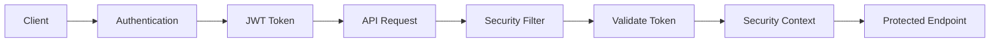
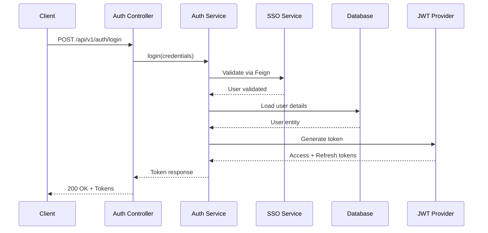
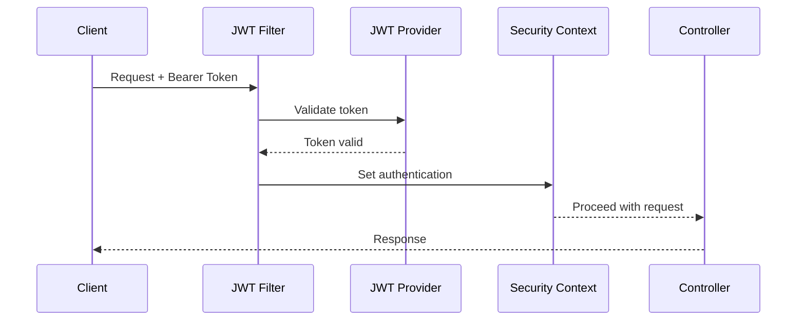

# Security Architecture

Control de Cambios implements a comprehensive security model using Spring Security and JWT tokens.

## Security Overview



## Authentication Flow

### 1. Login Process



### 2. Request Authentication



## JWT Token Structure

### Access Token

```json
{
  "sub": "username",
  "roles": ["ROLE_USER", "ROLE_ADMIN"],
  "iat": 1706971234,
  "exp": 1707057634
}
```

**Properties**:
- **Expiration**: 24 hours (86400 seconds)
- **Algorithm**: HS256 (HMAC with SHA-256)
- **Issuer**: Control de Cambios
- **Claims**: username, roles, timestamps

### Refresh Token

```json
{
  "sub": "username",
  "type": "refresh",
  "iat": 1706971234,
  "exp": 1707576034
}
```

**Properties**:
- **Expiration**: 7 days (604800 seconds)
- **Purpose**: Obtain new access tokens without re-authentication

## Security Configuration

### Spring Security Configuration

```java
@Configuration
@EnableWebSecurity
public class SecurityConfig extends WebSecurityConfigurerAdapter {
    
    @Override
    protected void configure(HttpSecurity http) throws Exception {
        http
            .csrf().disable()
            .sessionManagement()
                .sessionCreationPolicy(SessionCreationPolicy.STATELESS)
            .and()
            .authorizeRequests()
                .antMatchers("/api/v1/auth/**").permitAll()
                .antMatchers("/swagger-ui/**", "/api-docs/**").permitAll()
                .antMatchers("/actuator/health").permitAll()
                .anyRequest().authenticated()
            .and()
            .addFilterBefore(jwtAuthenticationFilter(), 
                UsernamePasswordAuthenticationFilter.class);
    }
}
```

### JWT Filter

The JWT filter intercepts all requests and:

1. Extracts the Bearer token from the `Authorization` header
2. Validates the token signature and expiration
3. Extracts user details from token claims
4. Sets authentication in the Security Context
5. Allows or denies the request

## Authorization

### Role-Based Access Control (RBAC)

**Available Roles**:
- `ROLE_USER` - Standard user access
- `ROLE_ADMIN` - Administrative access
- `ROLE_MANAGER` - Project manager access
- `ROLE_DEVELOPER` - Developer access

### Method-Level Security

```java
@PreAuthorize("hasRole('ADMIN')")
public void deleteProject(Integer id) {
    // Only admins can delete projects
}

@PreAuthorize("hasAnyRole('ADMIN', 'MANAGER')")
public void updateProject(ProyectoDTO dto) {
    // Admins and managers can update
}
```

### Endpoint Security Matrix

| Endpoint | Roles Required | Description |
|----------|----------------|-------------|
| `POST /api/v1/auth/login` | Public | Login endpoint |
| `GET /api/v1/proyecto/**` | USER, ADMIN, MANAGER | View projects |
| `POST /api/v1/proyecto/**` | ADMIN, MANAGER | Create projects |
| `PUT /api/v1/proyecto/**` | ADMIN, MANAGER | Update projects |
| `DELETE /api/v1/proyecto/**` | ADMIN | Delete projects |
| `GET /api/v1/registroControl/**` | USER, ADMIN, MANAGER | View change records |
| `POST /api/v1/registroControl/**` | USER, ADMIN, MANAGER, DEVELOPER | Create records |
| `PUT /api/v1/registroControl/**` | ADMIN, MANAGER, DEVELOPER | Update records |

## SSO Integration

### OpenFeign Client

```java
@FeignClient(name = "sso-service", url = "${sso.base-url}")
public interface SsoFeignClient {
    
    @PostMapping("/api/validateToken")
    ValidateTokenResponse validateToken(@RequestHeader("Authorization") String token);
    
    @PostMapping("/api/getOptions")
    OptionResponse getOptions(@RequestHeader("Authorization") String token);
}
```

### SSO Login Flow

1. Client authenticates with SSO service
2. SSO service returns token and user details
3. Application validates token via Feign client
4. Application creates internal user session
5. Application returns JWT tokens for subsequent requests

## Password Security

### Password Encoding

```java
@Bean
public PasswordEncoder passwordEncoder() {
    return new BCryptPasswordEncoder(12);
}
```

**Features**:
- BCrypt hashing algorithm
- Salt rounds: 12
- One-way encryption
- Rainbow table resistant

### Password Requirements

- Minimum length: 8 characters
- Must contain:
  - At least one uppercase letter
  - At least one lowercase letter
  - At least one number
  - At least one special character

## CORS Configuration

### Allowed Origins

Configure allowed origins in `application.properties`:

```properties
cors.allowed-origins=https://app.vortexbird.com,http://localhost:3000
cors.allowed-methods=GET,POST,PUT,DELETE,OPTIONS
cors.allowed-headers=*
cors.allow-credentials=true
cors.max-age=3600
```

### CORS Configuration Class

```java
@Configuration
public class CorsConfig implements WebMvcConfigurer {
    
    @Value("${cors.allowed-origins}")
    private String[] allowedOrigins;
    
    @Override
    public void addCorsMappings(CorsRegistry registry) {
        registry.addMapping("/api/**")
            .allowedOrigins(allowedOrigins)
            .allowedMethods("GET", "POST", "PUT", "DELETE", "OPTIONS")
            .allowedHeaders("*")
            .allowCredentials(true)
            .maxAge(3600);
    }
}
```

## Security Best Practices

### Token Storage

<Warning>
Never store JWT tokens in localStorage due to XSS vulnerabilities. Use httpOnly cookies or secure storage mechanisms.
</Warning>

**Recommended**:
- Store in httpOnly, secure cookies
- Use SameSite=Strict cookie attribute
- Implement CSRF protection for cookie-based auth

### Token Refresh Strategy

1. Access token expires after 24 hours
2. Client detects `401 Unauthorized` response
3. Client sends refresh token to refresh endpoint
4. Server validates refresh token
5. Server issues new access token
6. Client retries original request

### API Security Headers

```java
http.headers()
    .contentSecurityPolicy("default-src 'self'")
    .and()
    .frameOptions().deny()
    .and()
    .xssProtection().block(true)
    .and()
    .httpStrictTransportSecurity()
        .maxAgeInSeconds(31536000)
        .includeSubDomains(true);
```

**Headers Added**:
- `Content-Security-Policy`
- `X-Frame-Options: DENY`
- `X-XSS-Protection: 1; mode=block`
- `X-Content-Type-Options: nosniff`
- `Strict-Transport-Security`

## Audit Logging

All security-relevant events are logged:

- Login attempts (successful and failed)
- Token generation and validation
- Authorization failures
- Password changes
- User creation/deletion

Example log entry:
```
2024-02-03 15:30:45 INFO  SecurityAudit - User 'admin' logged in from IP 192.168.1.100
2024-02-03 15:31:12 WARN  SecurityAudit - Failed login attempt for user 'unknown' from IP 192.168.1.200
```

## Common Security Scenarios

### Extracting User from Request

```java
@PostMapping("/guardarRegistroControl")
public ResponseEntity<?> guardar(@RequestBody RegistroControlDTO dto) {
    // Get authenticated user
    UsernamePasswordAuthenticationToken auth = 
        (UsernamePasswordAuthenticationToken) SecurityContextHolder
            .getContext()
            .getAuthentication();
    
    String username = auth.getPrincipal().toString();
    
    return ResponseEntity.ok(service.guardar(dto, username));
}
```

### Custom Security Annotation

```java
@Target(ElementType.METHOD)
@Retention(RetentionPolicy.RUNTIME)
@PreAuthorize("hasRole('ADMIN') or @securityService.isOwner(#id, authentication)")
public @interface AdminOrOwner {
}
```

## Troubleshooting

### Token Expired

**Error**: `401 Unauthorized - Token has expired`

**Solution**: Use refresh token to obtain new access token

### Invalid Signature

**Error**: `401 Unauthorized - Invalid token signature`

**Solution**: Verify JWT secret is consistent across all instances

### Missing Authorization Header

**Error**: `401 Unauthorized - Missing or invalid Authorization header`

**Solution**: Include `Authorization: Bearer <token>` in request headers

## Security Checklist

- [x] JWT tokens with expiration
- [x] Password encryption with BCrypt
- [x] HTTPS in production
- [x] CORS configuration
- [x] Security headers
- [x] Method-level authorization
- [x] SSO integration
- [x] Audit logging
- [x] Session management (stateless)
- [x] Input validation
- [x] SQL injection prevention (JPA)
- [x] XSS prevention
- [x] CSRF protection
