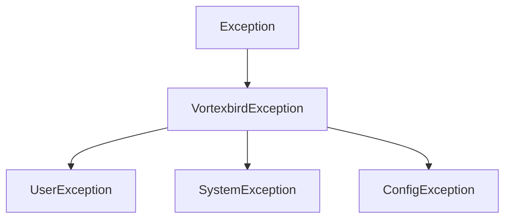

# Error Handling

Control de Cambios implements a comprehensive error handling strategy with custom exceptions and standardized error responses.

## Exception Hierarchy



### VortexbirdException (Base)

Base exception for all application-specific exceptions.

```java
public class VortexbirdException extends Exception {
    public VortexbirdException(String message) {
        super(message);
    }
    
    public VortexbirdException(String message, Throwable cause) {
        super(message, cause);
    }
}
```

### UserException

For user-related errors (invalid input, validation failures).

```java
public class UserException extends VortexbirdException {
    public UserException(String message) {
        super(message);
    }
}
```

**Use cases**:
- Invalid credentials
- Validation errors
- Unauthorized access
- Resource not found

### SystemException

For system-level errors (database, external services).

```java
public class SystemException extends VortexbirdException {
    public SystemException(String message) {
        super(message);
    }
    
    public SystemException(String message, Throwable cause) {
        super(message, cause);
    }
}
```

**Use cases**:
- Database connection failures
- External API errors
- I/O errors
- Transaction failures

### ConfigException

For configuration-related errors.

```java
public class ConfigException extends VortexbirdException {
    public ConfigException(String message) {
        super(message);
    }
}
```

**Use cases**:
- Missing configuration
- Invalid configuration values
- Environment setup errors

## Global Exception Handler

```java
@RestControllerAdvice
@Slf4j
public class GlobalExceptionHandler {
    
    @ExceptionHandler(UserException.class)
    public ResponseEntity<ErrorResponse> handleUserException(UserException ex) {
        log.warn("User exception: {}", ex.getMessage());
        ErrorResponse error = new ErrorResponse(
            LocalDateTime.now(),
            HttpStatus.BAD_REQUEST.value(),
            "Bad Request",
            ex.getMessage(),
            ""
        );
        return ResponseEntity.status(HttpStatus.BAD_REQUEST).body(error);
    }
    
    @ExceptionHandler(SystemException.class)
    public ResponseEntity<ErrorResponse> handleSystemException(SystemException ex) {
        log.error("System exception", ex);
        ErrorResponse error = new ErrorResponse(
            LocalDateTime.now(),
            HttpStatus.INTERNAL_SERVER_ERROR.value(),
            "Internal Server Error",
            "An unexpected error occurred",
            ""
        );
        return ResponseEntity.status(HttpStatus.INTERNAL_SERVER_ERROR).body(error);
    }
    
    @ExceptionHandler(MethodArgumentNotValidException.class)
    public ResponseEntity<ValidationErrorResponse> handleValidationException(
            MethodArgumentNotValidException ex) {
        log.warn("Validation failed: {}", ex.getMessage());
        
        List<FieldError> fieldErrors = ex.getBindingResult()
            .getFieldErrors()
            .stream()
            .map(error -> new FieldError(
                error.getField(),
                error.getDefaultMessage()
            ))
            .collect(Collectors.toList());
        
        ValidationErrorResponse error = new ValidationErrorResponse(
            LocalDateTime.now(),
            HttpStatus.BAD_REQUEST.value(),
            "Validation Failed",
            "Input validation failed",
            "",
            fieldErrors
        );
        
        return ResponseEntity.status(HttpStatus.BAD_REQUEST).body(error);
    }
    
    @ExceptionHandler(Exception.class)
    public ResponseEntity<ErrorResponse> handleGenericException(Exception ex) {
        log.error("Unexpected exception", ex);
        ErrorResponse error = new ErrorResponse(
            LocalDateTime.now(),
            HttpStatus.INTERNAL_SERVER_ERROR.value(),
            "Internal Server Error",
            "An unexpected error occurred",
            ""
        );
        return ResponseEntity.status(HttpStatus.INTERNAL_SERVER_ERROR).body(error);
    }
}
```

## Error Response Models

### ErrorResponse

```java
@Data
@AllArgsConstructor
public class ErrorResponse {
    private LocalDateTime timestamp;
    private int status;
    private String error;
    private String message;
    private String path;
}
```

Example:

```json
{
  "timestamp": "2024-02-03T15:30:45",
  "status": 404,
  "error": "Not Found",
  "message": "Registro de control no encontrado con ID: 999",
  "path": "/api/v1/registroControl/encontrarRegistroControl/999"
}
```

### ValidationErrorResponse

```java
@Data
@AllArgsConstructor
public class ValidationErrorResponse extends ErrorResponse {
    private List<FieldError> errors;
    
    @Data
    @AllArgsConstructor
    public static class FieldError {
        private String field;
        private String message;
    }
}
```

Example:

```json
{
  "timestamp": "2024-02-03T15:30:45",
  "status": 400,
  "error": "Bad Request",
  "message": "Validation failed",
  "path": "/api/v1/registroControl/guardarRegistroControl",
  "errors": [
    {
      "field": "proyId",
      "message": "Project ID is required"
    },
    {
      "field": "recoDescripcion",
      "message": "Description cannot be empty"
    }
  ]
}
```

## HTTP Status Codes

| Code | Status | Use Case |
|------|--------|----------|
| 200 | OK | Successful request |
| 201 | Created | Resource created successfully |
| 400 | Bad Request | Validation error, invalid input |
| 401 | Unauthorized | Authentication required/failed |
| 403 | Forbidden | Insufficient permissions |
| 404 | Not Found | Resource not found |
| 409 | Conflict | Resource conflict (e.g., duplicate) |
| 500 | Internal Server Error | System error |
| 503 | Service Unavailable | External service down |

## Message Manager

```java
@Component
public class ZMessManager {
    
    public static String ENTITY_NOT_FOUND = "Entity not found with ID: %s";
    public static String ENTITY_ALREADY_EXISTS = "Entity already exists: %s";
    public static String VALIDATION_FAILED = "Validation failed for field: %s";
    public static String REQUIRED_FIELD = "Field %s is required";
    public static String INVALID_FORMAT = "Invalid format for field: %s";
    public static String DATABASE_ERROR = "Database error occurred";
    public static String EXTERNAL_SERVICE_ERROR = "External service error: %s";
    
    public static String format(String template, Object... args) {
        return String.format(template, args);
    }
}
```

Usage:

```java
throw new UserException(
    ZMessManager.format(ZMessManager.ENTITY_NOT_FOUND, id)
);
```

## Custom Exceptions

### EntityNotFoundException

```java
public class EntityNotFoundException extends UserException {
    public EntityNotFoundException(String entityName, Object id) {
        super(String.format("%s not found with ID: %s", entityName, id));
    }
}
```

### DuplicateEntityException

```java
public class DuplicateEntityException extends UserException {
    public DuplicateEntityException(String entityName, String field, Object value) {
        super(String.format("%s already exists with %s: %s", 
            entityName, field, value));
    }
}
```

### ValidationException

```java
public class ValidationException extends UserException {
    private List<String> errors;
    
    public ValidationException(String message, List<String> errors) {
        super(message);
        this.errors = errors;
    }
}
```

## Validation

### Bean Validation

Use JSR-303/380 annotations:

```java
@Data
public class RegistroControlDTO {
    @NotNull(message = "Project ID is required")
    private Integer proyId;
    
    @NotBlank(message = "Description cannot be empty")
    @Size(min = 10, max = 2000, message = "Description must be between 10 and 2000 characters")
    private String recoDescripcion;
    
    @Email(message = "Invalid email format")
    private String solicitanteEmail;
    
    @DecimalMin(value = "0.0", message = "Hours must be positive")
    private BigDecimal recoHorasEstimadas;
}
```

### Custom Validators

```java
@Target({ElementType.FIELD})
@Retention(RetentionPolicy.RUNTIME)
@Constraint(validatedBy = FechaValidator.class)
public @interface ValidFecha {
    String message() default "Invalid date";
    Class<?>[] groups() default {};
    Class<? extends Payload>[] payload() default {};
}

public class FechaValidator implements ConstraintValidator<ValidFecha, LocalDate> {
    @Override
    public boolean isValid(LocalDate value, ConstraintValidatorContext context) {
        return value == null || !value.isBefore(LocalDate.now());
    }
}
```

## Logging

### Log Levels

- **ERROR**: System errors, exceptions
- **WARN**: User errors, validation failures
- **INFO**: Business operations
- **DEBUG**: Detailed debugging info

### Example Logging

```java
@Slf4j
@Service
public class CcRegistroControlServiceImpl {
    
    public RegistroControlDTO guardar(RegistroControlDTO dto, String usuario) {
        log.info("Saving registro control for project {}", dto.getProyId());
        
        try {
            RegistroControl entity = mapper.toEntity(dto);
            entity.setUsuarioCreacion(usuario);
            
            RegistroControl saved = repository.save(entity);
            log.debug("Saved registro control with ID: {}", saved.getRecoId());
            
            return mapper.toDTO(saved);
            
        } catch (DataAccessException e) {
            log.error("Database error saving registro control", e);
            throw new SystemException("Failed to save registro control", e);
        }
    }
}
```

## Error Handling Best Practices

1. **Always log exceptions** at appropriate level
2. **Don't expose sensitive data** in error messages
3. **Use specific exceptions** instead of generic Exception
4. **Provide meaningful error messages** to users
5. **Include request context** in error responses
6. **Handle all exceptions** at controller level
7. **Validate early** at controller/service boundaries
8. **Return consistent error format** across all endpoints

## Common Error Scenarios

### Not Found

```java
public RegistroControlDTO encontrarRegistroControl(Integer id) {
    return repository.findById(id)
        .map(mapper::toDTO)
        .orElseThrow(() -> new EntityNotFoundException("RegistroControl", id));
}
```

### Validation Error

```java
public void validarHoras(BigDecimal horas) {
    if (horas != null && horas.compareTo(BigDecimal.ZERO) < 0) {
        throw new ValidationException("Hours cannot be negative");
    }
}
```

###Database Error

```java
try {
    repository.save(entity);
} catch (DataAccessException e) {
    log.error("Database error", e);
    throw new SystemException("Failed to save entity", e);
}
```

### External Service Error

```java
try {
    SsoResponse response = ssoClient.validateToken(token);
    return response;
} catch (FeignException e) {
    log.error("SSO service error", e);
    throw new SystemException("SSO service unavailable", e);
}
```
