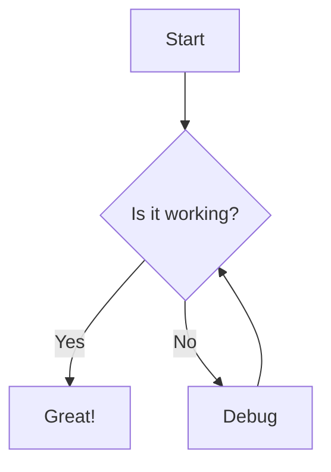

## Images

### Basic Image

Add images using standard markdown syntax:

```markdown

```

### Responsive Images

Use Mintlify's image component for responsive images:

```markdown

```

### Dark Mode Images

Show different images for light and dark modes:

```markdown


```

## Image Organization

Store your images in the `/images` directory:

```
images/
├── logo/
│   ├── dark.svg
│   └── light.svg
├── screenshots/
│   └── dashboard.png
└── diagrams/
    └── architecture.svg
```

## Videos

### Embedded Videos

Embed videos from popular platforms:

```markdown
<iframe
  width="560"
  height="315"
  src="https://www.youtube.com/embed/VIDEO_ID"
  title="YouTube video player"
  frameborder="0"
  allow="accelerometer; autoplay; clipboard-write; encrypted-media; gyroscope; picture-in-picture"
  allowfullscreen
></iframe>
```

### Video Callout

Use the Frame component for better video integration:

<Frame>
  
</Frame>

## Diagrams

### Mermaid Diagrams

Create diagrams using Mermaid syntax:



## Icons

Use Font Awesome icons in your documentation:

```markdown
<Icon icon="check" /> Success
<Icon icon="warning" /> Warning
<Icon icon="info" /> Information
```

## Best Practices

<AccordionGroup>
  <Accordion title="Optimize Images" icon="image">
    - Compress images to reduce file size
    - Use appropriate formats (SVG for logos, PNG for screenshots)
    - Keep images under 500KB when possible
  </Accordion>
  <Accordion title="Use Alt Text" icon="universal-access">
    Always provide descriptive alt text for accessibility
  </Accordion>
  <Accordion title="Organize Files" icon="folder">
    Keep images organized in subdirectories by type or section
  </Accordion>
</AccordionGroup>

<Tip>
  Use SVG format for logos and icons for better scalability
</Tip>
